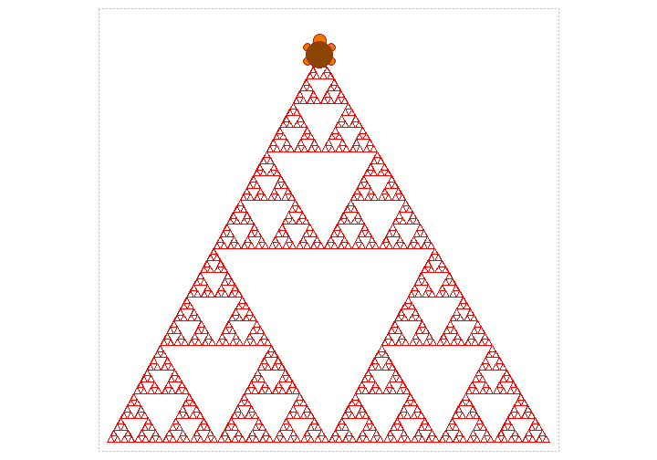
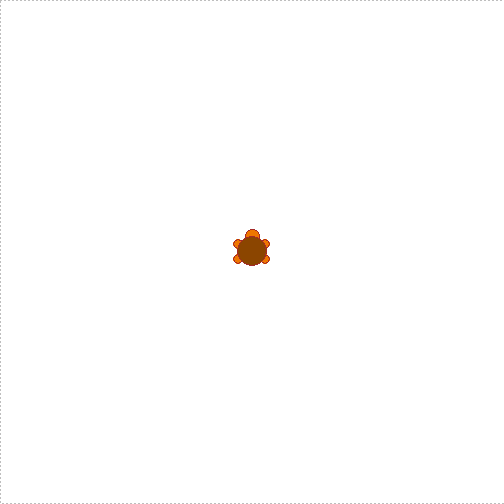
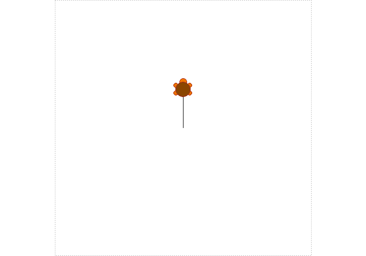
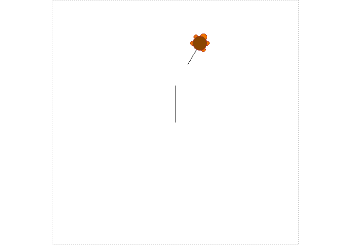
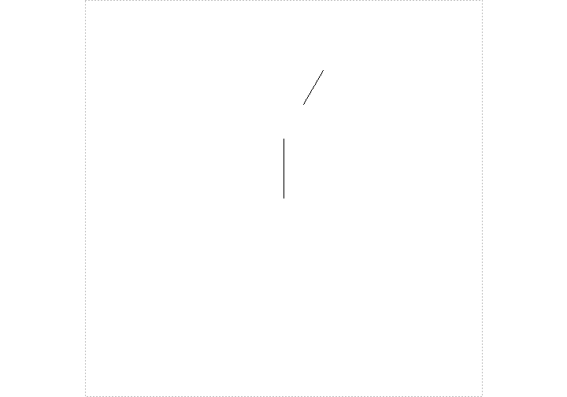

<h1> The famous Turtle Graphics is now available on R ! </h1>


<p>Do you find this plot fancy ? If yes you can find the code at the end of this article BUT if you spend a little time to read it thoroughly, you can learn how to create better ones.</p>


<p>We would like to encourage you and your children (yes, your children) to use our new R package - TurtleGraphics ! </p>
   
   
<p>TurtleGraphics package offers to R-users functionality of the "turtle graphics" from Logo educational programming language. The main idea standing behind it is to inspire the children to learn programming and show that working with computer can be entertaining and creative.</p>

<p>It is very elementary, clear and requires basic algorithm thinking skills, that even children are able to form them. You can learn it in just five short steps.</p>

* `turtle_init()` - To start using the program call the `turtle_init()` function. It creates a plot region (sometimes called "Terrarium") and places the Turtle in the middle pointing north.

```r
library(TurtleGraphics)
turtle_init()
```


* `turtle_forward()` and `turtle_backward()` - In its argument you
have to give the distance you desire the Turtle to move. For example, to move the Turtle forward for a distance of 10 units use the `turtle_forward()` function. To move the Turtle backwards you can use the `turtle_backward()` function.

```r
turtle_forward(dist=15)
```



* `turtle_turn()` - `turtle_right()` and `turtle_left()`. They change the Turtle's direction by a given angle. 


```r
turtle_right(angle=30)
```


* `turtle_up()` and `turtle_down()` - To disable the path from being drawn you can simply use the `turtle_up()` function. Let's consider a simple example. Turn the Turtle to the right by 90 degrees and then use the `turtle_up()` function. Now, when you move forward the path is not visible. If you want the path to be drawn
again you should call the `turtle_down()` function.


```r
turtle_up()
turtle_forward(dist=10)
turtle_down()
turtle_forward(dist=10)
```



* `turtle_show()` and `turtle_hide()` - Similarly, you may show or hide the Turtle image, using the `turtle_show()` and `turtle_hide()` functions respectively. If you call a lot of functions it is strongly recommended to hide the Turtle first as it speeds up the process.


```r
turtle_hide()
```


<p>These were just the basics of the package. Below we show you the true potential of it: </p>

```r
  turtle_star <- function(intensity=1){
  y <- sample(1:657, 360*intensity, replace=TRUE)
  for (i in 1:(360*intensity)){
  turtle_right(90)
  turtle_col(colors()[y[i]])
  x <- sample(1:100,1)
  turtle_forward(x)
  turtle_up()
  turtle_backward(x)
  turtle_down()
  turtle_left(90)
  turtle_forward(1/intensity)
  turtle_left(1/intensity)
  }}
  turtle_init(500,500)
  turtle_left(90)
  turtle_do({
  turtle_star(7)
  })
```


<p> One may wonder what `turtle_do()` function is doing here. It is an avdanced way to use the package. The `turtle\_do()` function is designed to call more complicated plot expressions, because it automatically hides the Turtle before starting the operations that occurs in a faster proceed of plotting.

```r
  drawTriangle<- function(points){
  turtle_setpos(points[1,1],points[1,2])
  turtle_goto(points[2,1],points[2,2])
  turtle_goto(points[3,1],points[3,2])
  turtle_goto(points[1,1],points[1,2])
  }
  getMid<- function(p1,p2) c((p1[1]+p2[1])/2, c(p1[2]+p2[2])/2)
  sierpinski <- function(points, degree){
  drawTriangle(points)
  if (degree  > 0){
  p1 <- matrix(c(points[1,], getMid(points[1,], points[2,]),
  getMid(points[1,], points[3,])), nrow=3, byrow=TRUE)
 
  sierpinski(p1, degree-1)
  p2 <- matrix(c(points[2,], getMid(points[1,], points[2,]),
  getMid(points[2,], points[3,])), nrow=3, byrow=TRUE)
 
  sierpinski(p2, degree-1)
  p3 <- matrix(c(points[3,], getMid(points[3,], points[2,]),
  getMid(points[1,], points[3,])), nrow=3, byrow=TRUE)
  sierpinski(p3, degree-1)
  }
  invisible(NULL)
  }
  turtle_init(520, 500, "clip")
  p <- matrix(c(10, 10, 510, 10, 250, 448), nrow=3, byrow=TRUE)
  turtle_col("red")
  turtle_do(sierpinski(p, 6))
  turtle_setpos(250, 448)
```


We kindly invite you to use [TurtleGraphics](http://www.rexamine.com/TurtleGraphics) ! Enjoy !
A full tutorial of this package is available [here](http://cran.r-project.org/web/packages/TurtleGraphics/vignettes/TurtleGraphics.pdf) .
<p> Marcin Kosinski, Natalia Potocka </p>


